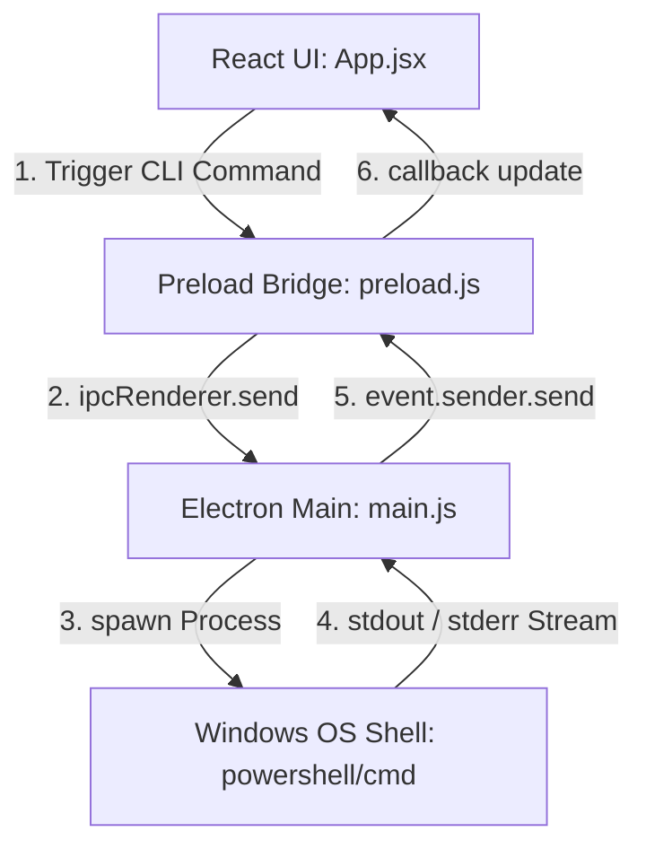

# Implementation Plan: Transferring Wefer from Mock-up to Real CLI System

This document outlines the detailed steps, security considerations, and verification checklist needed to transition the Wefer AI Orchestrator application from simulated outputs to a live desktop application executing real terminal commands (e.g., Anthropic's `claude` CLI, Google's `gemini` CLI, and OpenAI's `codex` CLI) on the host system. Execution model: every command is a **one-shot Run** (spawn → stream → exit); there are no persistent daemons or interactive sessions. See `CONTEXT.md` for the agreed domain language.

---

## 🏗️ Architecture Overview

To execute shell processes safely and stream outputs back to the React UI in real-time, Wefer will utilize **Electron IPC (Inter-Process Communication)** with asynchronous event streams:



---

## 🛠️ Phase-by-Phase Integration Plan

### Phase 1: Electron Main Process Upgrades (`main.js`)
We will replace basic window-control IPC with a process management engine using Node's `child_process.spawn`.

1. **Active Process Store**:
   Create a map in `main.js` to store references to running shell processes by `agentId`:
   ```javascript
   const activeProcesses = new Map();
   ```
2. **Process Spawner IPC Handler**:
   Listen for command trigger events, spawn a shell process, and hook data listeners:
   ```javascript
   ipcMain.on('run-cli-command', (event, { agentId, command }) => {
     // Busy collision policy: REJECT the new command — never silently kill a working Run.
     // Stopping a Run is only ever an explicit user action (Force Terminate).
     if (activeProcesses.has(agentId)) {
       event.sender.send('cli-output', {
         agentId, type: 'warning',
         text: 'Agent is busy with an active Run. Use Force Terminate to stop it first.'
       });
       return;
     }

     // Spawn shell process in the current Workspace (app-wide, user-selectable —
     // NOT hardcoded; defaults to the app folder until the user picks one)
     const child = spawn('powershell.exe', ['-Command', command], {
       cwd: currentWorkspace,
       env: { ...process.env }
     });

     activeProcesses.set(agentId, child);

     // Stream stdout
     child.stdout.on('data', (data) => {
       event.sender.send('cli-output', { agentId, type: 'info', text: data.toString() });
     });

     // Stream stderr
     child.stderr.on('data', (data) => {
       event.sender.send('cli-output', { agentId, type: 'error', text: data.toString() });
     });

     // Handle process closure — dedicated structured event, never string-matched by the UI
     child.on('close', (code) => {
       event.sender.send('cli-exit', { agentId, code });
       activeProcesses.delete(agentId);
     });
   });
   ```
   > Concurrency rule: each agent may have one active Run, but multiple agents run concurrently. Busy state is tracked **per agent**, never as a single global flag.
3. **Process Killer IPC Handler**:
   POSIX signals are faked on Windows — `child.kill()` would terminate only the `powershell.exe` parent and orphan its grandchildren (e.g. `claude.exe` keeps running and burning tokens). Kill the whole process tree with `taskkill`:
   ```javascript
   ipcMain.on('kill-cli-command', (event, { agentId }) => {
     const child = activeProcesses.get(agentId);
     if (!child) return;
     // /T = kill child tree, /F = force. The 'close' handler still fires and
     // emits 'cli-exit', so the UI flips to idle through the normal path.
     spawn('taskkill', ['/pid', String(child.pid), '/T', '/F']);
   });
   ```
   Note: do NOT `activeProcesses.delete(agentId)` here — the `close` event handler owns cleanup, keeping a single exit path.

---

### Phase 2: Preload Secure Bridging (`preload.js`)
Expose processes-related IPC methods safely to the window scope without enabling Node context directly in the renderer.

1. **Extend `contextBridge` exposure**:
   ```javascript
   contextBridge.exposeInMainWorld('electronAPI', {
     minimizeWindow: () => ipcRenderer.send('window-minimize'),
     maximizeWindow: () => ipcRenderer.send('window-maximize'),
     closeWindow: () => ipcRenderer.send('window-close'),
     
     // Live CLI integration methods
     runCliCommand: (agentId, command) => ipcRenderer.send('run-cli-command', { agentId, command }),
     killCliCommand: (agentId) => ipcRenderer.send('kill-cli-command', { agentId }),
     onCliOutput: (callback) => ipcRenderer.on('cli-output', (event, data) => callback(data)),
     onCliExit: (callback) => ipcRenderer.on('cli-exit', (event, data) => callback(data))
   });
   ```

---

### Phase 3: React Frontend Hookup (`frontend/src/App.jsx`)
Repurpose simulation methods to use real system callbacks.

1. **Initialize Global IPC Listener**:
   Add a `useEffect` hook in `App.jsx` to listen for output data streams and append them to log lists:
   ```javascript
   useEffect(() => {
     if (!window.electronAPI) return;

     window.electronAPI.onCliOutput(({ agentId, type, text }) => {
       const timestamp = new Date().toLocaleTimeString();
       setAgentLogs(prev => ({
         ...prev,
         [agentId]: [
           ...(prev[agentId] || []),
           { id: Date.now() + Math.random(), type, text, timestamp }
         ]
       }));
     });

     // Run lifecycle is driven by the structured exit event — busy state is per-agent
     window.electronAPI.onCliExit(({ agentId, code }) => {
       setAgentLogs(prev => ({
         ...prev,
         [agentId]: [
           ...(prev[agentId] || []),
           { id: Date.now() + Math.random(), type: code === 0 ? 'success' : 'error', text: `Process exited with code ${code}.`, timestamp: new Date().toLocaleTimeString() }
         ]
       }));
       setAgents(prev => prev.map(a => a.id === agentId ? { ...a, status: 'idle' } : a));
     });
   }, []);
   ```
   > The global `isRunningSimulation` flag is removed. The terminal input/buttons derive "busy" from the **selected agent's** `status === 'working'`, so agent B stays usable while agent A is running.
2. **Upgrade `runTerminalCommand`**:
   Replace mock logic with direct IPC calls:
   ```javascript
   const runTerminalCommand = (cmdText) => {
     if (!cmdText.trim()) return;
     
     // Log the command immediately in the terminal view
     const now = new Date();
     const timestampStr = now.toLocaleTimeString();
     setAgentLogs(prev => ({
       ...prev,
       [selectedAgentId]: [
         ...(prev[selectedAgentId] || []),
         { id: Date.now(), type: 'command', text: cmdText, timestamp: timestampStr }
       ]
     }));

     setIsRunningSimulation(true);
     setAgents(prev => prev.map(a => a.id === selectedAgentId ? { ...a, status: 'working' } : a));

     if (window.electronAPI && window.electronAPI.runCliCommand) {
       // Fire real command
       window.electronAPI.runCliCommand(selectedAgentId, cmdText);
     }
   };
   ```
3. **Upgrade Process Killer GUI Action**:
   ```javascript
   // Inside "Force Terminate CLI" button action:
   if (window.electronAPI && window.electronAPI.killCliCommand) {
     window.electronAPI.killCliCommand(selectedAgentId);
   }
   ```

---

## 🔒 Security & Safe Execution Rules

Threat model: the only command author is the trusted local user on their own machine (same trust level as Windows Terminal). No network or third-party input reaches the command string, so **no command sanitization/whitelist filtering** — pipes, `&&`, and full PowerShell semantics are intentionally allowed.

Remaining guardrails:
- **Path Locking**: Runs always execute with `cwd` pinned to the workspace directory.
- **Executable Validation**: Verify that CLIs like `claude` and `git` are installed and exist in the system `PATH` before invoking them. Return standard warning logs if not found.

---

## 📋 Integration Checklist

### Phase 1: Electron Main Core
- [ ] Install `cross-spawn` (optional, for smoother cross-platform Windows command resolving).
- [ ] Add `activeProcesses` Map reference in `main.js`.
- [ ] Implement `ipcMain.on('run-cli-command')` handler (reject when the agent already has an active Run).
- [ ] Implement `ipcMain.on('kill-cli-command')` handler using `taskkill /pid <pid> /T /F` (tree kill — plain `child.kill()` orphans grandchildren on Windows).
- [ ] Add `currentWorkspace` state in `main.js` (default: app folder) + `choose-workspace` IPC handler opening `dialog.showOpenDialog` and returning the selected folder.
- [ ] Wire up window closure hook to tree-kill all remaining active child processes.

### Phase 2: Preload Secure Bridge
- [ ] Add `runCliCommand` method entry to `preload.js`.
- [ ] Add `killCliCommand` method entry to `preload.js`.
- [ ] Add `onCliOutput` callback subscription hook to `preload.js`.

### Phase 3: React Renderer (UI Integration)
- [ ] Add `window.electronAPI.onCliOutput` + `onCliExit` global listeners inside `App.jsx`.
- [ ] Replace `runTerminalCommand` simulation logic with real `window.electronAPI.runCliCommand` calls (terminal input = raw passthrough to PowerShell, no rewriting).
- [ ] Connect "Force Terminate CLI" button to `window.electronAPI.killCliCommand`.
- [ ] Rewrite all GUI Presets to real non-interactive CLI syntax: `claude -p "..."` (Anthropic), `gemini -p "..."` (Google), `codex exec "..."` (OpenAI). The mock vocabulary (`claude commit --auto-message`, `antigravity audit`, `codex boilerplate`) does not exist.
- [ ] Rename the `antigravity-cli` agent/platform to Gemini CLI (`gemini` binary) — Antigravity is an IDE, not a CLI.
- [ ] Selecting an agent is pure navigation: remove the auto-fired startup commands from `selectAndLaunchAgent` (no spawn on select).
- [ ] CLI availability check runs **once at app startup** (`claude --version`, `gemini --version`, `codex --version`), result stored per agent (e.g. `cliFound` badge replacing the mock `apiKeySet`).
- [ ] Replace the hardcoded "Workspace Directory" panel with the live Workspace path + a Browse button calling the `choose-workspace` IPC.

### Phase 4: Quality & Safety Guardrails
- [ ] Handle command binary-not-found errors elegantly (show clear user messages for CLI path errors).
- [ ] Force UTF-8 output from PowerShell (`[Console]::OutputEncoding = [Text.Encoding]::UTF8` prefix or `chcp 65001`) — verify Thai/Unicode text streams correctly on Windows codepage 874.
- [ ] `preload.js` listeners must return an unsubscribe function (`ipcRenderer.removeListener`), and the `App.jsx` `useEffect` must clean up — otherwise React StrictMode double-mount duplicates every Output Line.
- [ ] Guard `event.sender.send` with `!event.sender.isDestroyed()` — output arriving after a window reload/close crashes otherwise.
- [ ] Verify multi-line scroll height updates on fast streams.

### Phase 5: Mock Data Cleanup
- [ ] `tasksRun`, `commandsCount`, `lastActive` count real Runs (increment on `cli-exit`).
- [ ] Remove the random `contextUsed` / `totalTokens` increments and the random CPU/RAM simulation — hide the two context-bound Dashboard cards ("Gemini Context Memory", "Claude Code Context") and the CPU/RAM header badges until real usage parsing exists (future iteration).
- [ ] Keep `clear` intercepted in the renderer as the sole local command: wipes the selected agent's Output Lines, never spawns a process.
- [ ] Reword daemon-flavored UI copy ("console daemon", "Linked to Local Socket", "Launch AI Provider Daemon") to match the one-shot Run model.
